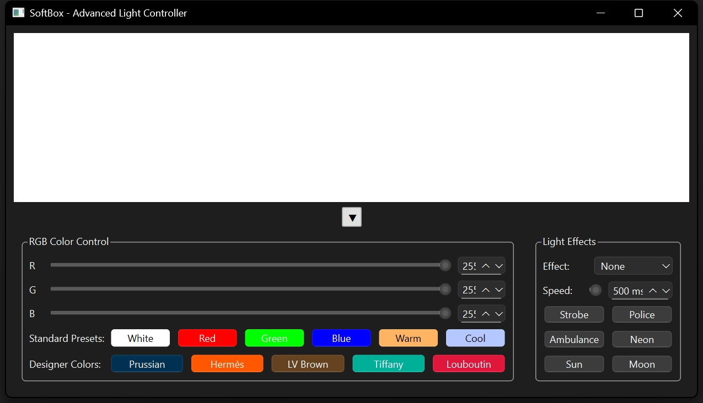
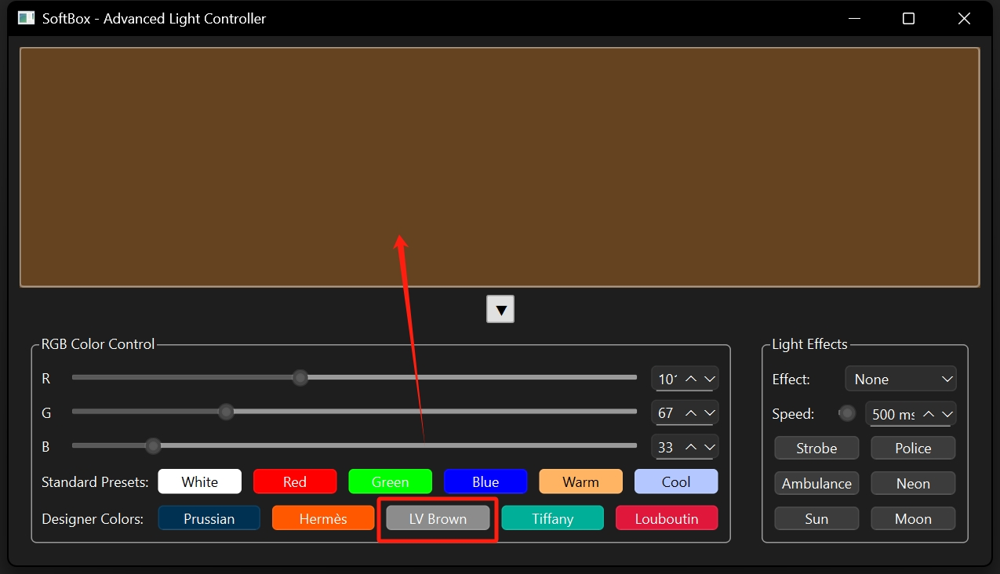
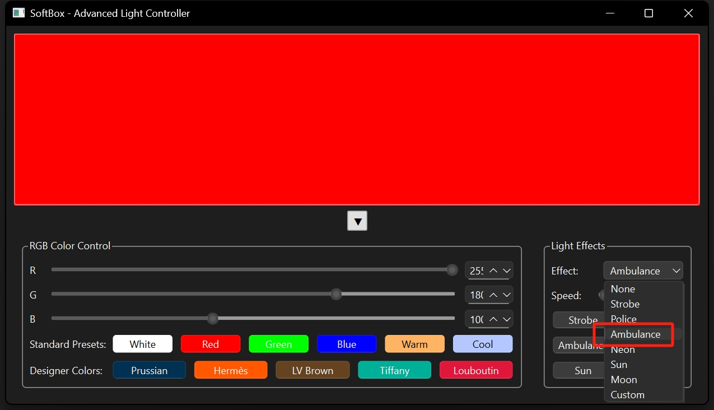
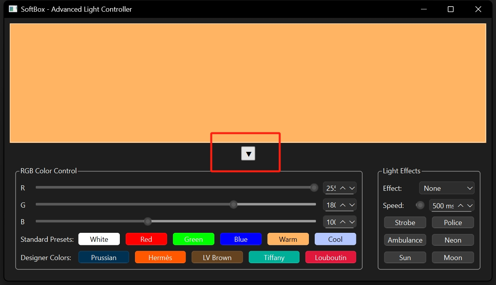
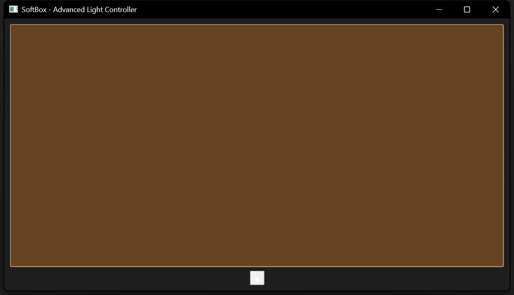
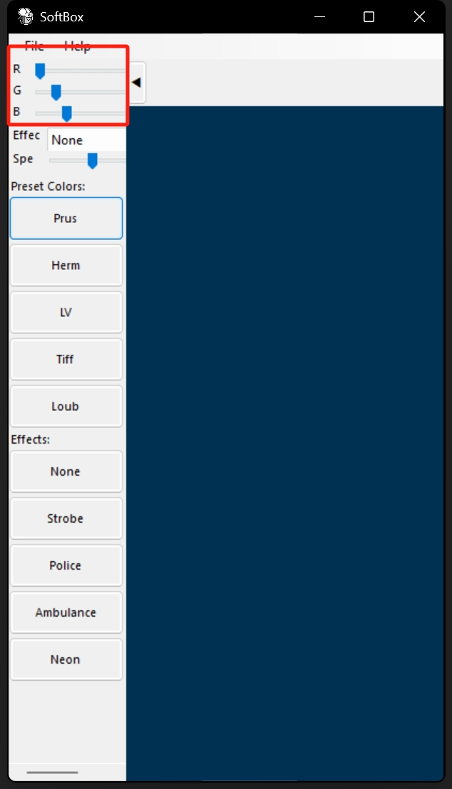

# SoftBox

SoftBox is a tool for photographer to use screen as a light box. This is also an extreme exercise of PySide6.

#### Version: 1.0

## Installation

```Bash
pip install softbox
```

## Usage in Python interpreter

After the installation step above, SoftBox now becomes available in Python. And you can simply use it by type the following commands in your Python interpreter :

```Bash
import sys
import softbox as sb
sys.exit(sb.begin())
```

## Run from Source Code

Clone the repository and run the following command in the root directory of the repository :

```Bash
git clone https://github.com/EasyCam/SoftBox.git
cd SoftBox
```

### Run the PySide6 Version

```Bash
cd softbox_gui
briefcase dev
```

### Run the Toga Version

```Bash
cd softbox_toga
briefcase dev
```

## Use Installer

Download the innstaller from https://pan.baidu.com/s/15dEeSmhkoaaOo9rGbtMkNw?pwd=349d with the code: 349d 

### Windows MSI Installer

Double click the `Soft Box.msi` file to install.

### ZIP Runner

Unzip the `Soft Box.zip` file to get the `Soft Box.exe` file.

### Android AAB Installer

Use the `Soft Box.aab` file to install on Android.

## Usage

The Start Screen is as follows:


Click the button to change the color of the light box:


The light box can be scrolled to change the effects of the light box:


The light box can be scrolled:


The control parts scrolled is like:


The Android GUI is as follows:


## License

This project is licensed under the GPLv3 License - see the [LICENSE.md](LICENSE.md) file for details.


